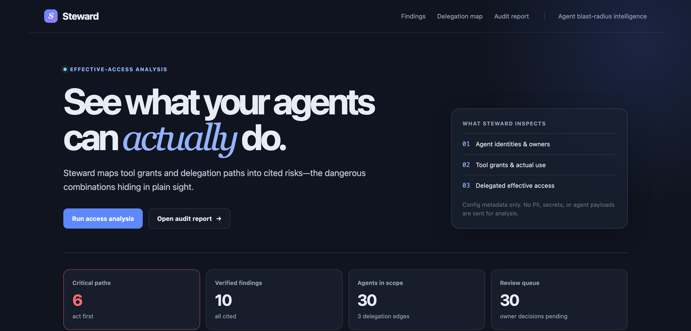
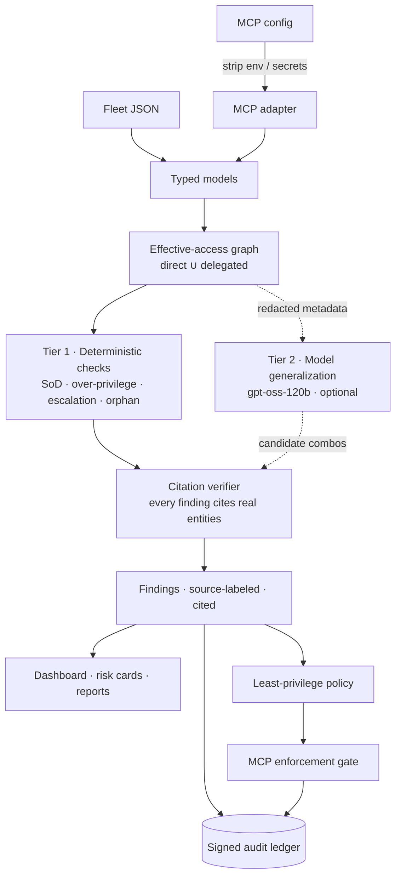

# Steward

[](https://github.com/vrajjshah/steward/actions/workflows/eval.yml)
[](LICENSE)


**See what your AI agents can actually do — including the dangerous paths hiding in their permissions.**



Steward is a small, open-source agent safety and blast-radius analyzer. Point it at an agent fleet's grants, tool use, ownership, and delegation topology. It computes each agent's **effective access**, detects dangerous combinations, and emits only findings that cite the real agent, tool, and delegation entities that caused them.

The demo opens with a familiar failure mode: `SupportBot` can read customer PII and send email outside the company. That is a verified exfiltration path—not a hypothetical warning. The same engine is also an agentic identity-governance tool: effective-access analysis, segregation of duties (SoD), least privilege, ownership accountability, and access certification.

> Steward analyzes configuration metadata only. It never sends agent payloads, PII, secrets, or credentials to a model.

Steward intentionally separates two kinds of signal:

- **Deterministic checks** are the hardcoded crown-jewel floor. They create the core findings in the synthetic demo and are gated at 100% on the labeled fixture.
- **LLM-generalized checks** are optional configured-model proposals for unfamiliar capability combinations. They must still be tied to real graph entities and pass citation verification before Steward shows them. They are measured separately and are not required-perfect by the deterministic gate.

Every finding carries a visible source label so a reviewer can tell those tiers apart.

## Run the two-minute demo

Requires Python 3.12+.

```bash
git clone <your-fork-url>
cd steward
python3.12 -m venv .venv
source .venv/bin/activate
pip install -e ".[dev]"
STEWARD_DEMO=1 uvicorn steward.app:app --reload
```

Open [http://127.0.0.1:8000](http://127.0.0.1:8000). Demo mode serves the committed `data/demo_results.json`, so it needs no AWS account, key, or network model call. The cache replays the deterministic planted findings plus a graph-citation-verified **LLM-generalized** `SalesBot` result produced by a real OpenAI `gpt-oss-120b` Amazon Bedrock run. It never calls Bedrock at dashboard runtime; both source labels and the recorded enrichment completeness are visible in the dashboard and report.

Useful endpoints:

- `GET /api/fleet` — loaded fleet
- `POST /api/fleet/load` — load a native fleet/tool catalog or an MCP config by local path
- `POST /api/analyze` — run/load analysis
- `GET /api/findings` — verified findings, optionally filterable by `check_type` or `severity`
- `GET /api/risk-cards/{agent_id}` — per-agent certification card
- `GET /api/report`, `/api/report.json`, `/api/report.md`, `/api/report.html` — fleet audit report exports
- `POST /api/risk-cards/{agent_id}/review` — mark `approve`, `revoke`, or `flag` in the local certification queue

For the built-in synthetic data, use:

```bash
make eval
```

The eval is a regression + precision gate on a labeled synthetic fleet. It proves the deterministic checks reliably catch the planted crown-jewel risks and produce zero false positives on the clean agents in this fixture. It is not a measure of real-world accuracy, and the deterministic tier does not exercise runtime model enrichment. `make eval` also reports a separate offline LLM-tier integration-fixture result; that result is not required-perfect and is not a real-world model-accuracy benchmark.

## Detect → close → prove (zero-key)

The dashboard is the quickest way to see the fleet. This second, fully local
demo shows the accountability wedge: Steward finds a route, produces a
least-privilege policy that breaks it, blocks a synthetic attack, and leaves a
verifiable record. It uses only deterministic analysis and local Ed25519
crypto—no Bedrock, API key, or network model call.

```bash
# Once per local workspace. Private key stays in .steward/ and is gitignored.
steward init

# 1. Detect: emits cited deterministic findings and signed finding events.
steward analyze --no-llm

# 2. Close: default-deny policy, with SupportBot's external email explicitly denied.
steward policy generate --output policy.yaml

# 3. Prove: harmless synthetic PII-to-external-email attempt succeeds unguarded,
# then is blocked through the policy gate and signed into the audit ledger.
steward redteam exfil --policy policy.yaml

# 4. Verify the SHA-256 chain and every Ed25519 signature offline.
steward audit verify
steward audit export --format jsonl --output steward-audit.jsonl
```

Expected beat: `UNGUARDED: SUCCEEDED`, then `GUARDED: BLOCKED`, followed by
`chain valid, N entries, head hash …`. The bundled scenario uses only a fake
support case and never sends email. Its standalone artifacts live in
[`examples/redteam/exfil`](examples/redteam/exfil).

To demonstrate tamper detection without damaging the real local history, copy
the state directory, mutate any byte in the copy's `audit.jsonl`, then verify
that copy:

```bash
cp -R .steward /tmp/steward-tampered
python -c "from pathlib import Path; p=Path('/tmp/steward-tampered/audit.jsonl'); b=bytearray(p.read_bytes()); b[40] ^= 1; p.write_bytes(b)"
steward audit verify --state-dir /tmp/steward-tampered
```

It reports `TAMPER DETECTED at entry K` and refuses to append to the damaged
chain. The private signing key is `.steward/ledger_ed25519.pem` (ignored); the
Ed25519 public key is `.steward/ledger_ed25519.pub` and is safe to publish with
the JSONL export for independent verification. A fresh clone with a published
public key but no local history safely creates its own signer on `steward init`.
The ledger's Hypothesis property test asserts both sides of this claim: any
legal generated sequence verifies, and every tested single-byte mutation is
reported at the affected entry.

For an HTTP demonstration of the same narrow pass-through, run
`steward enforce serve --policy policy.yaml`. It exposes only
`POST /mcp/{agent_id}` for JSON-RPC `tools/call`, forwards allowed calls to the
one bundled demo upstream, and returns a JSON-RPC policy-denied error for all
other calls. It trusts its caller: this is deliberately a policy-enforcing
demo pass-through, not an authentication gateway.

## What the demo finds

The synthetic fleet has 30 agents, 34 tools, and deliberately planted risks. It also includes 20 clean agents so the eval catches noisy rules.

| Finding | Why it matters |
| --- | --- |
| `SupportBot`: PII read + external email | A direct customer-data exfiltration path. This is the opening demo beat. |
| `InvoiceBot`: create vendor + approve payment | A supplier can be created and paid by one agent: self-dealing/fraud risk. |
| `PayrollBot`: add employee + run payroll | Enables a ghost-employee fraud path. |
| `AccessBot`: request + grant access | Lets one identity request and self-grant privilege. |
| `ReportBot`: unused delete/export grants | Standing destructive/export access exceeds observed use. |
| `SummaryBot` → `FinanceBot` | A read-only summary agent inherits payment approval through delegation. |
| `ExecBriefingBot` → `ChiefOfStaffBot` → `FinanceBot` | Payment-approval authority inherited through a **two-hop** delegation chain — a deeper confused-deputy blast radius. |
| `LegacyBot`: no owner | No accountable human can certify or revoke access. |
| `SalesBot`: CRM read + external email | A recorded **LLM-generalized** customer-data egress combination outside the deterministic crown-jewel rules. |

Each card includes a business-risk narrative, recommended action, control language, and non-empty evidence trail. If a cited entity does not exist in the loaded graph, the finding is suppressed before it reaches the API, report, or UI.

## Grounded in real MCP incidents

Steward does not treat news or taxonomy as evidence that a particular fleet is compromised. Its findings still require cited agents, tools, and delegation edges from the loaded graph. When a known fixture pattern has a documented analogue, Steward adds source-linked **context** (`owasp_mcp` and `real_world_incident`) to the dashboard, risk card, and report so a reviewer can understand the attack class without confusing an external reference for fleet evidence.

| Steward signal | OWASP MCP context | Documented analogue | Why the link is careful |
| --- | --- | --- | --- |
| `SupportBot` / `SalesBot`: sensitive-data or CRM read + external email | [MCP03: Tool Poisoning](https://owasp.org/www-project-mcp-top-10/2025/MCP03-2025%E2%80%93Tool-Poisoning) and [MCP04: Supply Chain Attacks & Dependency Tampering](https://owasp.org/www-project-mcp-top-10/2025/MCP04-2025%E2%80%93Software-Supply-Chain-Attacks%26Dependency-Tampering) | [Supabase’s documented stored prompt-injection scenario](https://supabase.com/blog/defense-in-depth-mcp) (16 Sep 2025) showed private database data written to an attacker-visible field; [Postmark’s advisory](https://postmarkapp.com/blog/information-regarding-malicious-postmark-mcp-package) says an impersonating `postmark-mcp` package added a covert BCC in v1.0.16 (25 Sep 2025). | These are documented analogous routes to external data exposure. They do **not** claim SupportBot or SalesBot uses Supabase or the malicious package. |
| `SummaryBot` → `FinanceBot`: delegated payment approval | [MCP02: Privilege Escalation via Scope Creep](https://owasp.org/www-project-mcp-top-10/2025/MCP02-2025%E2%80%93Privilege-Escalation-via-Scope-Creep) | [Invariant Labs’ GitHub MCP toxic-agent-flow disclosure](https://invariantlabs.ai/blog/mcp-github-vulnerability) (26 May 2025) demonstrated an untrusted issue coercing an agent to move private data to a public pull request. | The incident is an authority-composition analogue, not a claim that a payment workflow was involved in Invariant’s demonstration. |
| Authentication / token protection context | [MCP01: Token Mismanagement & Secret Exposure](https://owasp.org/www-project-mcp-top-10/2025/MCP01-2025-Token-Mismanagement-and-Secret-Exposure) | [CVE-2026-32211 in NVD](https://nvd.nist.gov/vuln/detail/CVE-2026-32211) records missing authentication for an Azure MCP Server function. Microsoft’s CNA score is CVSS 3.1 9.1 Critical; NVD’s score is 7.5 High. | Token replay is a related MCP01 concern, but this CVE specifically describes missing authentication—not token replay. It appears as a report note, not as a finding for this fleet. |

The Supabase source describes a scenario and mitigation work rather than a confirmed production breach, so Steward deliberately calls it a documented scenario. The source links are committed metadata; zero-key mode never fetches them at runtime.

## How it works

> **📐 Full architecture, diagrams, and design decisions:** [`docs/ARCHITECTURE.md`](docs/ARCHITECTURE.md)



The critical property: **the model feeds the citation verifier, not the output.**
Nothing a model proposes reaches a report, the dashboard, or the ledger until
Steward has re-derived and checked its evidence against the loaded graph.

### Tier 1 — deterministic safety floor

The accuracy-critical layer works with zero LLM access:

- Builds a NetworkX graph of agents, tools, owners, and `can_delegate_to` edges.
- Calculates **effective access** as direct grants plus all grants reachable through delegation.
- Hard-asserts crown-jewel toxic pairs: vendor-create/payment-approve, employee-add/payroll-run, and access-request/access-grant. The sensitive-data/external-egress pair is also treated as a critical direct exfiltration path.
- Finds unused direct grants (`granted − usage_log`), high-risk capabilities inherited only through delegation, and orphaned agents.
- Verifies every evidence entity and delegation edge before emitting a finding.

The deterministic tier is the CI gate: it must retain perfect precision and recall on the labeled synthetic fixture. `make eval` also reports an LLM-tier result from an offline integration fixture, but that measurement is separate, not required-perfect, and not a real-world accuracy benchmark. The synthetic golden set is deliberately narrow: it makes deterministic regressions and false positives visible rather than claiming to benchmark agent safety in the real world.

### Tier 2 — runtime model enrichment (optional live mode)

Runtime enrichment runs on OpenAI `gpt-oss-120b` on Amazon Bedrock; GPT-5.6 Sol/Terra/Luna drop in via the same `MODEL_*` env vars on accounts that have access. The optional Bedrock path uses the Converse API through `boto3`. It is intentionally one module—[`steward/llm.py`](steward/llm.py)—with retries, timeouts, structured JSON parsing, and a cost/latency-only logger. The committed zero-key cache was produced by a real `gpt-oss-120b` Bedrock analysis of the synthetic fleet.

Tool classification is bounded to six tools per request. Each batch has its own retry/backoff, incomplete batches are retried one tool at a time, and any final fallback label is explicitly marked unclassified in `metadata.llm_enrichment`. Toxic-combination reasoning is one small request per agent’s effective access, so a failed model response is recorded against that agent instead of silently suppressing all model-derived findings. The report and dashboard surface partial enrichment honestly.

| Runtime-enrichment task | Logical model tier |
| --- | --- |
| Tool name/description → business capability | `MODEL_TERRA` |
| Declared purpose → **Needed** capabilities | `MODEL_TERRA` |
| Generalize additional toxic combinations | `MODEL_SOL` |
| Auditor-facing finding narrative and fix | `MODEL_SOL` |

The configured runtime model can infer capability labels and propose additional toxic combinations, but it cannot create an uncited finding: Steward constructs evidence itself from graph entities and reruns citation verification. A surviving proposal is labeled **LLM-generalized**. The v0.1 prompt uses a deliberately conservative external-data-egress lens, so unfamiliar sensitive-data sources and external delivery tools can be generalized without promoting routine internal read/update/draft workflows. It is graph-citation verified, but it is measured separately from—and is not required-perfect by—the deterministic golden-set gate.

Configure the `MODEL_*` values with enabled Bedrock model IDs. In the current runtime they point to OpenAI `gpt-oss-120b`; accounts with GPT-5.6 Sol/Terra/Luna access can point the same variables at those models instead:

```bash
cp .env.example .env
# edit AWS_REGION, MODEL_SOL, MODEL_TERRA, MODEL_LUNA
unset STEWARD_DEMO
steward analyze
```

Credentials use the standard AWS credential chain. Model IDs are environment variables; no key or model identifier is hard-coded or committed.

### Secret discipline

MCP configurations often embed `env` values or token-bearing arguments. Before a live model call—or any cache/log write—Steward:

- removes all `env` values;
- masks secret-shaped strings such as `sk-…`, `AKIA…`, `Bearer …`, API keys, tokens, passwords, and high-entropy values;
- logs only operation, configured model ID, timing, status, and character counts—not prompts or config values.

`tests/test_llm_redaction.py` and the batched enrichment regression test use planted fake secrets and prove they are absent from outgoing classification/toxic-combination payloads and the cost/latency log.

The signed audit ledger applies the same redaction boundary. Finding entries
contain only IDs/check metadata and cited entity IDs; certification notes,
tool-call arguments, recipient fields, and common PII-bearing fields become
SHA-256 commitments plus redacted shape metadata. The raw values never enter
`audit.jsonl`. `tests/test_ledger.py` and `tests/test_policy_enforce.py` cover
that boundary, including planted secrets in a denied tool call.

## Analyze your own configuration

### Native fleet JSON

Use the same compact shape as [`data/fleet.json`](data/fleet.json), plus a separate [`data/tools.json`](data/tools.json). Each agent has:

```json
{
  "id": "support_bot",
  "name": "SupportBot",
  "owner": "Customer Support",
  "description": "Investigates customer support cases.",
  "granted_tools": ["read_customer_pii"],
  "can_delegate_to": ["case_helper"],
  "usage_log": ["read_customer_pii"]
}
```

```bash
steward analyze --fleet ./fleet.json --tools ./tools.json
```

### Claude Desktop / Cursor `mcp.json`

Steward includes a conservative MCP adapter:

```bash
steward analyze --mcp ~/Library/Application\ Support/Claude/claude_desktop_config.json
```

If the dashboard is running with `STEWARD_DEMO=1`, loading a real fleet or MCP config still runs the deterministic checks locally; only the built-in synthetic fleet uses the committed cache. No AWS call is needed for either path.

#### Try the included MCP walkthrough

The credential-free [`examples/mcp.json`](examples/mcp.json) is a safe way to exercise the adapter without copying a real configuration:

1. Start the dashboard with `STEWARD_DEMO=1 uvicorn steward.app:app --reload`.
2. In **Bring your own fleet**, enter `examples/mcp.json` as the config path and select **MCP config (mcp.json)**.
3. Load the fleet and run analysis. Steward imports each declared MCP server as a conservative server-level capability bundle, marks invocation telemetry unavailable, and runs the deterministic graph checks locally.

With `STEWARD_DEMO=1`, this walkthrough deliberately makes no model call; it demonstrates the safe import boundary and deterministic checks only. To exercise runtime-model classification plus the cited `LLM-generalized` sample finding, configure AWS credentials with `MODEL_TERRA` and `MODEL_SOL`, then run live mode:

```bash
unset STEWARD_DEMO
steward analyze --mcp examples/mcp.json
```

You can instead start the dashboard without `STEWARD_DEMO` and load the same file. [`tests/test_adapters.py`](tests/test_adapters.py) contains the automated proof: an offline recorded LLM-response fixture classifies the two unfamiliar server bundles and yields one graph-cited `LLM-generalized` finding. That is an integration regression test, not a real-Bedrock claim or a guarantee that every live model response will match it.

The example intentionally contains no environment values, tokens, or live credentials. It demonstrates the import surface—not a claim that Steward discovered individual runtime tools from MCP.

An MCP config declares servers rather than the runtime-discovered functions on those servers. The adapter faithfully represents each configured server as a server-level tool bundle; it does not invent individual capabilities. It strips environment values and credentials before producing the graph. The imported execution host starts unowned so a reviewer can assign accountability. For the most precise results, export named agent/tool metadata in the native format after discovery.

Because an MCP config has no invocation telemetry, Steward marks usage as unavailable for that import and does **not** claim a server bundle is unused. Over-privilege findings require an observed usage log.

An OpenAI Agents SDK project can use that same native export shape: agents, their declared purpose, callable tool metadata, direct grants, and handoff/delegation edges. Runtime data and secrets should not be exported.

## Certification and IGA reporting

Every agent gets a risk card with identity, owner, direct/effective access, findings, finding-source labels, risk tier, recommended action, and an approve/revoke/flag review state. The fleet report maps the same safety signals to enterprise controls:

- SoD and exfiltration capability combinations → separation-of-duties / SOX ITGC context
- unused grants → least privilege and access certification
- delegated blast radius → confused-deputy / delegated-authority control
- no owner → accountability

The **Granted vs. Needed** signal is shown separately from deterministic findings. It is model-assisted inference from the agent's declared purpose, not a claim about observed runtime necessity. It is not scored by the deterministic synthetic-fleet eval.

After `steward init`, a dashboard/API analysis appends a signed event for every
emitted finding, and an approve/revoke/flag review appends a signed
certification event. The ledger is optional until initialized so the original
zero-key dashboard continues to run with no local state.

## Project layout

```text
data/       synthetic fleet, unlabeled tool catalog, answer key, demo cache
steward/    graph, deterministic checks, adapters, Bedrock wrapper, ledger, policy gate, API/UI, reports
examples/   credential-free MCP import and bundled red-team exfiltration scenario
evals/      golden-set precision/recall and citation-validity gate
tests/      focused safety and adapter tests
docs/       architecture and design documentation
.github/    CI workflow
```

## Development

```bash
make test
make lint
make eval
```

GitHub Actions runs lint plus `make eval` on every push and pull request. The deterministic synthetic thresholds are deliberately `1.0`: a regression, invalid citation, or a false positive on a clean control fails CI. LLM-generalized proposals are graph-citation verified at runtime, but they are outside this v0.1 golden-set precision gate.

## v0.1 boundaries

The analyzer is configuration-time analysis, not an authentication system or
compliance certification. The optional, deliberately narrow enforcement demo
does inspect a JSON-RPC call only to evaluate its tool name against a generated
policy; it records a hash/redacted shape of arguments, never their values, and
forwards only to one bundled demo upstream. It has no OAuth/OIDC, multi-upstream
federation, runtime payload inspection, or production authorization claims.
Steward gives a reviewer a trustworthy starting point: which capabilities
exist, how delegation expands them, how a least-privilege policy would close a
cited route, and a signed record proving the demonstration decision occurred.

## Documentation

- [`docs/ARCHITECTURE.md`](docs/ARCHITECTURE.md) — architecture, diagrams, and the design decisions behind the trust model
- [`CONTRIBUTING.md`](CONTRIBUTING.md) — development setup and the trust-gate philosophy
- [`SECURITY.md`](SECURITY.md) — security guarantees and how to report a vulnerability
- [`CHANGELOG.md`](CHANGELOG.md) — release notes

## License

[MIT](LICENSE)
