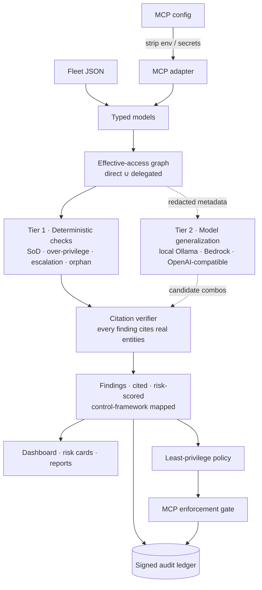

# Steward

[](https://steward-production-19c1.up.railway.app/)
[](https://github.com/vrajjshah/steward/actions/workflows/eval.yml)
[](LICENSE)


**See what your AI agents can actually do — including the dangerous paths hiding in their permissions.**

[](https://steward-production-19c1.up.railway.app/)

**▶️ [Try the live demo](https://steward-production-19c1.up.railway.app/)** — a zero-key dashboard; nothing to install.

Steward is a small, open-source agent safety and blast-radius analyzer — **non-human identity (NHI) governance for AI agents**. Point it at an agent fleet's grants, tool use, ownership, and delegation topology. It computes each agent's **effective access**, detects dangerous combinations, and emits only findings that cite the real agent, tool, and delegation entities that caused them. Agents are identities; Steward brings them the discipline — SoD, least privilege, certification, accountable ownership — that human identities already get.

**Why a security team can say yes quickly:**

- **Zero-risk deployment.** Configuration-time and read-only: Steward analyzes config metadata, needs no production access, changes nothing, and the deterministic tier runs with no cloud account or key — nothing leaves the machine. The optional model tier sends redacted configuration metadata only, never payloads or credentials.
- **Evidence an auditor can use.** Findings carry graph-verified citations, a reproducible 0–100 risk score, and versioned control-framework references (NIST 800-53, SOC 2, ISO 27001, SOX ITGC, EU AI Act); review decisions land in an Ed25519-signed, tamper-evident ledger verifiable offline.

The demo opens with a familiar failure mode: `SupportBot` can read customer PII and send email outside the company. That is a verified exfiltration path—not a hypothetical warning. The same engine is also an agentic identity-governance tool: effective-access analysis, segregation of duties (SoD), least privilege, ownership accountability, and access certification.

> Steward analyzes configuration metadata only. It never sends agent payloads, PII, secrets, or credentials to a model.

Steward intentionally separates two kinds of signal:

- **Deterministic checks** are the hardcoded crown-jewel floor. They create the core findings in the synthetic demo and are gated at 100% on the labeled fixture.
- **LLM-generalized checks** are optional configured-model proposals for unfamiliar capability combinations. They must still be tied to real graph entities and pass citation verification before Steward shows them. They are measured separately and are not required-perfect by the deterministic gate.

Every finding carries a visible source label so a reviewer can tell those tiers apart.

## Run the two-minute demo

Requires Python 3.12+.

```bash
git clone <your-fork-url>
cd steward
python3.12 -m venv .venv
source .venv/bin/activate
pip install -e ".[dev]"
STEWARD_DEMO=1 uvicorn steward.app:app --reload
```

Open [http://127.0.0.1:8000](http://127.0.0.1:8000). Demo mode serves the committed `data/demo_results.json`, so it needs no AWS account, key, or network model call. The cache replays the deterministic planted findings plus a graph-citation-verified **LLM-generalized** `SalesBot` result produced by a real OpenAI `gpt-oss-120b` Amazon Bedrock run. It never calls Bedrock at dashboard runtime; both source labels and the recorded enrichment completeness are visible in the dashboard and report.

Useful endpoints:

- `GET /api/fleet` — loaded fleet
- `POST /api/fleet/load` — load a native fleet/tool catalog or an MCP config by local path
- `POST /api/analyze` — run/load analysis
- `GET /api/findings` — verified findings, optionally filterable by `check_type` or `severity`
- `GET /api/risk-cards/{agent_id}` — per-agent certification card
- `GET /api/report`, `/api/report.json`, `/api/report.md`, `/api/report.html` — fleet audit report exports
- `POST /api/risk-cards/{agent_id}/review` — mark `approve`, `revoke`, or `flag` in the local certification queue

For the built-in synthetic data, use:

```bash
make eval
```

The eval is a regression + precision gate on a labeled synthetic fleet. It proves the deterministic checks reliably catch the planted crown-jewel risks and produce zero false positives on the clean agents in this fixture. It is not a measure of real-world accuracy, and the deterministic tier does not exercise runtime model enrichment. `make eval` also reports a separate offline LLM-tier integration-fixture result; that result is not required-perfect and is not a model-accuracy benchmark. The model tier's accuracy is measured separately on a [labeled 20-scenario benchmark](#how-accurate-is-the-model-tier) (`make llm-benchmark`).

## Detect → close → prove (zero-key)

The dashboard is the quickest way to see the fleet. This second, fully local
demo shows the accountability wedge: Steward finds a route, produces a
least-privilege policy that breaks it, blocks a synthetic attack, and leaves a
verifiable record. It uses only deterministic analysis and local Ed25519
crypto—no Bedrock, API key, or network model call.

```bash
# Once per local workspace. Private key stays in .steward/ and is gitignored.
steward init

# 1. Detect: emits cited deterministic findings and signed finding events.
steward analyze --no-llm

# 2. Close: default-deny policy, with SupportBot's external email explicitly denied.
steward policy generate --output policy.yaml

# 3. Prove: harmless synthetic PII-to-external-email attempt succeeds unguarded,
# then is blocked through the policy gate and signed into the audit ledger.
steward redteam exfil --policy policy.yaml

# 4. Verify the SHA-256 chain and every Ed25519 signature offline.
steward audit verify
steward audit export --format jsonl --output steward-audit.jsonl
```

Expected beat: `UNGUARDED: SUCCEEDED`, then `GUARDED: BLOCKED`, followed by
`chain valid, N entries, head hash …`. The bundled scenario uses only a fake
support case and never sends email. Its standalone artifacts live in
[`examples/redteam/exfil`](examples/redteam/exfil).

To demonstrate tamper detection without damaging the real local history, copy
the state directory, mutate any byte in the copy's `audit.jsonl`, then verify
that copy:

```bash
cp -R .steward /tmp/steward-tampered
python -c "from pathlib import Path; p=Path('/tmp/steward-tampered/audit.jsonl'); b=bytearray(p.read_bytes()); b[40] ^= 1; p.write_bytes(b)"
steward audit verify --state-dir /tmp/steward-tampered
```

It reports `TAMPER DETECTED at entry K` and refuses to append to the damaged
chain. The private signing key is `.steward/ledger_ed25519.pem` (ignored); the
Ed25519 public key is `.steward/ledger_ed25519.pub` and is safe to publish with
the JSONL export for independent verification. A fresh clone with a published
public key but no local history safely creates its own signer on `steward init`.
The ledger's Hypothesis property test asserts both sides of this claim: any
legal generated sequence verifies, and every tested single-byte mutation is
reported at the affected entry.

For an HTTP demonstration of the same narrow pass-through, run
`steward enforce serve --policy policy.yaml`. It exposes only
`POST /mcp/{agent_id}` for JSON-RPC `tools/call`, forwards allowed calls to the
one bundled demo upstream, and returns a JSON-RPC policy-denied error for all
other calls. It trusts its caller: this is deliberately a policy-enforcing
demo pass-through, not an authentication gateway.

## What the demo finds

The synthetic fleet has 30 agents, 34 tools, and deliberately planted risks. It also includes 20 clean agents so the eval catches noisy rules.

| Finding | Why it matters |
| --- | --- |
| `SupportBot`: PII read + external email | A direct customer-data exfiltration path. This is the opening demo beat. |
| `InvoiceBot`: create vendor + approve payment | A supplier can be created and paid by one agent: self-dealing/fraud risk. |
| `PayrollBot`: add employee + run payroll | Enables a ghost-employee fraud path. |
| `AccessBot`: request + grant access | Lets one identity request and self-grant privilege. |
| `ReportBot`: unused delete/export grants | Standing destructive/export access exceeds observed use. |
| `SummaryBot` → `FinanceBot` | A read-only summary agent inherits payment approval through delegation. |
| `ExecBriefingBot` → `ChiefOfStaffBot` → `FinanceBot` | Payment-approval authority inherited through a **two-hop** delegation chain — a deeper confused-deputy blast radius. |
| `LegacyBot`: no owner | No accountable human can certify or revoke access. |
| `SalesBot`: CRM read + external email | A recorded **LLM-generalized** customer-data egress combination outside the deterministic crown-jewel rules. |

Each card includes a business-risk narrative, recommended action, control language, and non-empty evidence trail. If a cited entity does not exist in the loaded graph, the finding is suppressed before it reaches the API, report, or UI.

## Grounded in real MCP incidents

Steward does not treat news or taxonomy as evidence that a particular fleet is compromised. Its findings still require cited agents, tools, and delegation edges from the loaded graph. When a known fixture pattern has a documented analogue, Steward adds source-linked **context** (`owasp_mcp` and `real_world_incident`) to the dashboard, risk card, and report so a reviewer can understand the attack class without confusing an external reference for fleet evidence.

| Steward signal | OWASP MCP context | Documented analogue | Why the link is careful |
| --- | --- | --- | --- |
| `SupportBot` / `SalesBot`: sensitive-data or CRM read + external email | [MCP03: Tool Poisoning](https://owasp.org/www-project-mcp-top-10/2025/MCP03-2025%E2%80%93Tool-Poisoning) and [MCP04: Supply Chain Attacks & Dependency Tampering](https://owasp.org/www-project-mcp-top-10/2025/MCP04-2025%E2%80%93Software-Supply-Chain-Attacks%26Dependency-Tampering) | [Supabase’s documented stored prompt-injection scenario](https://supabase.com/blog/defense-in-depth-mcp) (16 Sep 2025) showed private database data written to an attacker-visible field; [Postmark’s advisory](https://postmarkapp.com/blog/information-regarding-malicious-postmark-mcp-package) says an impersonating `postmark-mcp` package added a covert BCC in v1.0.16 (25 Sep 2025). | These are documented analogous routes to external data exposure. They do **not** claim SupportBot or SalesBot uses Supabase or the malicious package. |
| `SummaryBot` → `FinanceBot`: delegated payment approval | [MCP02: Privilege Escalation via Scope Creep](https://owasp.org/www-project-mcp-top-10/2025/MCP02-2025%E2%80%93Privilege-Escalation-via-Scope-Creep) | [Invariant Labs’ GitHub MCP toxic-agent-flow disclosure](https://invariantlabs.ai/blog/mcp-github-vulnerability) (26 May 2025) demonstrated an untrusted issue coercing an agent to move private data to a public pull request. | The incident is an authority-composition analogue, not a claim that a payment workflow was involved in Invariant’s demonstration. |
| Authentication / token protection context | [MCP01: Token Mismanagement & Secret Exposure](https://owasp.org/www-project-mcp-top-10/2025/MCP01-2025-Token-Mismanagement-and-Secret-Exposure) | [CVE-2026-32211 in NVD](https://nvd.nist.gov/vuln/detail/CVE-2026-32211) records missing authentication for an Azure MCP Server function. Microsoft’s CNA score is CVSS 3.1 9.1 Critical; NVD’s score is 7.5 High. | Token replay is a related MCP01 concern, but this CVE specifically describes missing authentication—not token replay. It appears as a report note, not as a finding for this fleet. |

The Supabase source describes a scenario and mitigation work rather than a confirmed production breach, so Steward deliberately calls it a documented scenario. The source links are committed metadata; zero-key mode never fetches them at runtime.

## How it works

> **📐 Full architecture, diagrams, and design decisions:** [`docs/ARCHITECTURE.md`](docs/ARCHITECTURE.md)



The critical property: **the model feeds the citation verifier, not the output.**
Nothing a model proposes reaches a report, the dashboard, or the ledger until
Steward has re-derived and checked its evidence against the loaded graph.

### Tier 1 — deterministic safety floor

The accuracy-critical layer works with zero LLM access:

- Builds a NetworkX graph of agents, tools, owners, and `can_delegate_to` edges.
- Calculates **effective access** as direct grants plus all grants reachable through delegation.
- Hard-asserts crown-jewel toxic pairs: vendor-create/payment-approve, employee-add/payroll-run, and access-request/access-grant. The sensitive-data/external-egress pair is also treated as a critical direct exfiltration path.
- Finds unused direct grants (`granted − usage_log`), high-risk capabilities inherited only through delegation, and orphaned agents.
- Verifies every evidence entity and delegation edge before emitting a finding.

The deterministic tier is the CI gate: it must retain perfect precision and recall on the labeled synthetic fixture. `make eval` also reports an LLM-tier result from an offline integration fixture, but that measurement is separate, not required-perfect, and not a real-world accuracy benchmark. The synthetic golden set is deliberately narrow: it makes deterministic regressions and false positives visible rather than claiming to benchmark agent safety in the real world.

### Tier 2 — runtime model enrichment (optional live mode)

The model tier is **backend-pluggable** — one module ([`steward/llm.py`](steward/llm.py)) with retries, timeouts, structured JSON parsing, a cost/latency-only logger, and the same redaction boundary on every backend. Select with `LLM_BACKEND`:

| `LLM_BACKEND` | What it talks to | Who it's for |
| --- | --- | --- |
| `ollama` / `local` / `openai-compatible` | Any `/v1/chat/completions` endpoint; defaults to a local Ollama at `http://localhost:11434/v1` (`LLM_BASE_URL` retargets, `LLM_API_KEY` optional) | **Recommended for security teams**: the full model tier with no cloud account and no data egress — nothing leaves the machine |
| `bedrock` (default) | Amazon Bedrock via the Converse API (`boto3`) | Teams already on AWS. Open-weight `gpt-oss-120b` is the tested default; **Anthropic Claude models are verified drop-ins** (Steward automatically omits sampling parameters, which current Claude models reject) |
| `openai` | Any hosted OpenAI-compatible API | Teams standardized on a hosted provider |

Every backend uses the same `MODEL_SOL`/`MODEL_TERRA`/`MODEL_LUNA` tier contract — a Bedrock model or inference-profile ID, an Ollama tag, or a hosted model name. **Steward's trust properties are deliberately model- and backend-independent**: the deterministic floor never calls a model, and a proposal from any backend passes the same graph-citation verifier before it can surface. The committed zero-key cache was produced by a real `gpt-oss-120b` Bedrock analysis of the synthetic fleet.

**Which model should you run?** We A/B-tested the toxic-combination tier on the [labeled 20-scenario benchmark](#how-accurate-is-the-model-tier): open-weight `gpt-oss-120b` and Claude Opus 4.8 (both on Bedrock) scored **identically perfect** — 8/8 in-scope recall, 0/8 false positives, 0/4 out-of-scope flags, zero hallucinated citations — at roughly $0.008 vs. $0.29 per benchmark run. At measured-accuracy parity, the recommended Bedrock default stays the open-weight model on cost; Claude is a config-only swap for orgs that standardize on it. Honest caveat: a 20-scenario benchmark cannot separate two models that both hit its ceiling — the claim is parity *on this benchmark*, not equivalence in general.

Tool classification is bounded to six tools per request. Each batch has its own retry/backoff, incomplete batches are retried one tool at a time, and any final fallback label is explicitly marked unclassified in `metadata.llm_enrichment`. Toxic-combination reasoning is one small request per agent’s effective access, so a failed model response is recorded against that agent instead of silently suppressing all model-derived findings. The report and dashboard surface partial enrichment honestly.

| Runtime-enrichment task | Logical model tier |
| --- | --- |
| Tool name/description → business capability | `MODEL_TERRA` |
| Declared purpose → **Needed** capabilities | `MODEL_TERRA` |
| Generalize additional toxic combinations | `MODEL_SOL` |
| Auditor-facing finding narrative and fix | `MODEL_SOL` |

The configured runtime model can infer capability labels and propose additional toxic combinations, but it cannot create an uncited finding: Steward constructs evidence itself from graph entities and reruns citation verification. A surviving proposal is labeled **LLM-generalized**. The v0.1 prompt uses a deliberately conservative external-data-egress lens, so unfamiliar sensitive-data sources and external delivery tools can be generalized without promoting routine internal read/update/draft workflows. It is graph-citation verified, but it is measured separately from—and is not required-perfect by—the deterministic golden-set gate.

#### How accurate is the model tier?

The model tier is measured on a committed, labeled 20-scenario benchmark ([`evals/benchmark/`](evals/benchmark)): 8 in-scope toxic sensitive-read + external-egress pairs, 8 engineered benign near-misses (internal-only delivery, draft-only senders, ticket creation, public sources), and 4 genuinely toxic pairs deliberately outside the v0.1 egress-only prompt scope. The benchmark fleet is deterministically silent, so every flag comes from the model tier.

On the cached live `gpt-oss-120b` run ([`evals/benchmark/results.json`](evals/benchmark/results.json)), the model tier flagged **8/8 in-scope toxic pairs (recall 1.000)** with **0/8 false positives (precision 1.000)** and **zero hallucinated citations**, and correctly declined to flag the 4 out-of-scope pairs its prompt assigns to the deterministic floor. This is a 20-scenario synthetic measurement from a single temperature-0 run — evidence the egress lens separates real toxic pairs from near-misses, not a real-world accuracy claim. `make llm-benchmark` re-verifies the committed result offline; `make llm-benchmark-live` reruns it against whatever backend and models `LLM_BACKEND`/`MODEL_*` select. Details and limits: [`docs/ARCHITECTURE.md`](docs/ARCHITECTURE.md#how-accurate-is-tier-2-actually).

Getting started with either backend:

```bash
cp .env.example .env
# Local (recommended for security teams): LLM_BACKEND=ollama and MODEL_* set to your local tags
# Bedrock: LLM_BACKEND=bedrock, AWS_REGION, and MODEL_* set to enabled model IDs
unset STEWARD_DEMO
steward analyze
```

Bedrock credentials use the standard AWS credential chain; the local backend needs no credentials at all. Model IDs are environment variables; no key or model identifier is hard-coded or committed.

### Secret discipline

MCP configurations often embed `env` values or token-bearing arguments. Before a live model call—or any cache/log write—Steward:

- removes all `env` values;
- masks secret-shaped strings such as `sk-…`, `AKIA…`, `Bearer …`, API keys, tokens, passwords, and high-entropy values;
- logs only operation, configured model ID, timing, status, and character counts—not prompts or config values.

`tests/test_llm_redaction.py` and the batched enrichment regression test use planted fake secrets and prove they are absent from outgoing classification/toxic-combination payloads and the cost/latency log.

The signed audit ledger applies the same redaction boundary. Finding entries
contain only IDs/check metadata and cited entity IDs; certification notes,
tool-call arguments, recipient fields, and common PII-bearing fields become
SHA-256 commitments plus redacted shape metadata. The raw values never enter
`audit.jsonl`. `tests/test_ledger.py` and `tests/test_policy_enforce.py` cover
that boundary, including planted secrets in a denied tool call.

## Analyze your own configuration

### Native fleet JSON

Use the same compact shape as [`data/fleet.json`](data/fleet.json), plus a separate [`data/tools.json`](data/tools.json). Each agent has:

```json
{
  "id": "support_bot",
  "name": "SupportBot",
  "owner": "Customer Support",
  "description": "Investigates customer support cases.",
  "granted_tools": ["read_customer_pii"],
  "can_delegate_to": ["case_helper"],
  "usage_log": ["read_customer_pii"]
}
```

```bash
steward analyze --fleet ./fleet.json --tools ./tools.json
```

### Claude Desktop / Cursor `mcp.json`

Steward includes a conservative MCP adapter:

```bash
steward analyze --mcp ~/Library/Application\ Support/Claude/claude_desktop_config.json
```

For a small registry of widely used servers — filesystem, GitHub, Slack, PostgreSQL, SQLite, fetch, Brave Search, Google Drive, memory, Puppeteer, Sentry — the adapter recognizes the **exact package identifier** in the server's `command`/`args` and imports that package's **documented capability set** as individual tools (e.g. the GitHub server becomes *read repositories*, *create/update issues and PRs*, and *push repository content* instead of one opaque bundle). That gives the analysis real read/write/egress texture to reason about. Honest limits, stated in every imported node and note: the mapping reflects the package's documented toolset, not runtime tool discovery; a different version, flag set, or allowlist may expose different tools; and a server merely *named* `github` is never assumed to be the GitHub server — only the package identifier matches. Unrecognized servers still import as one conservative server-level bundle. [`examples/claude_desktop_config.json`](examples/claude_desktop_config.json) is a realistic, credential-free sample that exercises both paths:

```bash
steward analyze --mcp examples/claude_desktop_config.json --no-llm
```

If the dashboard is running with `STEWARD_DEMO=1`, loading a real fleet or MCP config still runs the deterministic checks locally; only the built-in synthetic fleet uses the committed cache. No AWS call is needed for either path.

#### Try the included MCP walkthrough

The credential-free [`examples/mcp.json`](examples/mcp.json) is a safe way to exercise the adapter without copying a real configuration:

1. Start the dashboard with `STEWARD_DEMO=1 uvicorn steward.app:app --reload`.
2. In **Bring your own fleet**, enter `examples/mcp.json` as the config path and select **MCP config (mcp.json)**.
3. Load the fleet and run analysis. Steward imports each declared MCP server as a conservative server-level capability bundle, marks invocation telemetry unavailable, and runs the deterministic graph checks locally.

With `STEWARD_DEMO=1`, this walkthrough deliberately makes no model call; it demonstrates the safe import boundary and deterministic checks only. To exercise runtime-model classification plus the cited `LLM-generalized` sample finding, configure AWS credentials with `MODEL_TERRA` and `MODEL_SOL`, then run live mode:

```bash
unset STEWARD_DEMO
steward analyze --mcp examples/mcp.json
```

You can instead start the dashboard without `STEWARD_DEMO` and load the same file. [`tests/test_adapters.py`](tests/test_adapters.py) contains the automated proof: an offline recorded LLM-response fixture classifies the two unfamiliar server bundles and yields one graph-cited `LLM-generalized` finding. That is an integration regression test, not a real-Bedrock claim or a guarantee that every live model response will match it.

The example intentionally contains no environment values, tokens, or live credentials. It demonstrates the import surface—not a claim that Steward discovered individual runtime tools from MCP.

An MCP config declares servers rather than the runtime-discovered functions on those servers. The adapter represents each recognized server at its documented-capability granularity and every other server as a server-level tool bundle; it does not invent capabilities beyond a recognized package's documentation. It strips environment values and credentials before producing the graph. The imported execution host starts unowned so a reviewer can assign accountability. For the most precise results, export named agent/tool metadata in the native format after discovery.

Because an MCP config has no invocation telemetry, Steward marks usage as unavailable for that import and does **not** claim a server bundle is unused. Over-privilege findings require an observed usage log.

An OpenAI Agents SDK project can use that same native export shape: agents, their declared purpose, callable tool metadata, direct grants, and handoff/delegation edges. Runtime data and secrets should not be exported.

### Runtime traces — the "Used" pillar

Grants say what an agent *may* do; traces say what it *did*. Point `--traces` at a JSONL execution log — one event per line with `timestamp`, `agent_id`, `tool_id`, and optional `status`, a shape that maps directly from OpenTelemetry GenAI spans or any agent framework's invocation log:

```bash
steward analyze --no-llm --traces examples/traces.jsonl
```

Observed usage fills the **Used** pillar for the agents that appear in the trace window (agents outside it keep "telemetry unavailable" rather than being misread as unused), the over-privilege check runs on real runtime data, and the reconciliation report adds three signals:

- **granted but never used** — standing access with no observed invocation in the window: the revocation candidate list;
- **used but not granted** — an invocation outside the agent's *effective* access, reported as `DRIFT`: either the inventory is stale or the runtime is not enforcing it. This deliberately cannot be a finding — the citation verifier rejects evidence outside effective access by design — so it surfaces as reconciliation drift;
- **used but not needed** — observed use of a capability the model tier inferred the declared purpose does not require; model-assisted review context, labelled as such.

Events naming unknown agents or tools stay visible as drift lines (a retired identity still running is itself a governance signal). Tool-call arguments, results, and prompts are ignored at parse time and never retained — trace ingestion reads identity metadata only. [`examples/traces.jsonl`](examples/traces.jsonl) demonstrates all three signals against the demo fleet, and `--fail-on-drift` turns the drift signal into a non-zero exit for CI (see [Gate your own CI on Steward](#gate-your-own-ci-on-steward)).

## Certification and IGA reporting

Every agent gets a risk card with identity, owner, direct/effective access, findings, finding-source labels, risk tier, a deterministic composite risk score, recommended action, and an approve/revoke/flag review state. The fleet report opens with a board-ready executive summary — fleet size, top risks ranked by the reproducible score, framework coverage, and review status — and maps the same safety signals to enterprise controls:

- SoD, exfiltration, and lethal-trifecta capability combinations → separation-of-duties / SOX ITGC context
- unused grants → least privilege and access certification
- delegated blast radius → confused-deputy / delegated-authority control
- no owner → accountability

Each finding also carries structured, versioned control-framework references — NIST SP 800-53 Rev. 5, SOC 2 TSC, ISO/IEC 27001:2022, SOX ITGC, and the EU AI Act — summarized in a coverage matrix. That is auditor context in the auditor's language, deliberately not a compliance certification.

The **Granted vs. Needed** signal is shown separately from deterministic findings. It is model-assisted inference from the agent's declared purpose, not a claim about observed runtime necessity. It is not scored by the deterministic synthetic-fleet eval.

After `steward init`, a dashboard/API analysis appends a signed event for every
emitted finding, and an approve/revoke/flag review appends a signed
certification event. The ledger is optional until initialized so the original
zero-key dashboard continues to run with no local state.

## Project layout

```text
data/       synthetic fleet, unlabeled tool catalog, answer key, demo cache
steward/    graph, deterministic checks, scoring, control mapping, adapters, traces, model backends, ledger, policy gate, API/UI, reports
examples/   credential-free MCP imports, sample runtime trace, bundled red-team exfiltration scenario
evals/      golden-set gate + labeled LLM-tier accuracy benchmark
tests/      focused safety, adapter, scoring, and gating tests
docs/       architecture, cost, and audience documentation
.github/    CI workflow
```

## Development

```bash
make test
make lint
make eval
```

GitHub Actions runs lint plus `make eval` on every push and pull request. The deterministic synthetic thresholds are deliberately `1.0`: a regression, invalid citation, or a false positive on a clean control fails CI. LLM-generalized proposals are graph-citation verified at runtime, but they are outside this v0.1 golden-set precision gate.

### Gate your own CI on Steward

`steward analyze` exits non-zero when you tell it what should fail a build, so a pull request that grants an agent a toxic pair — or a trace window showing access used outside the inventory — stops before merge:

```bash
# Fail the build on any high-or-critical finding (deterministic, no keys needed)
steward analyze --no-llm --fleet fleet.json --tools tools.json --fail-on high

# Fail the build when runtime traces show drift (used-but-not-granted access)
steward analyze --no-llm --traces traces.jsonl --fail-on-drift
```

The full findings and reconciliation report are printed before the non-zero exit, so the CI log carries the evidence a reviewer needs.

### Review what a change actually did (`steward diff`)

The recurring governance question is not "is this fleet risky?" but "what did *this change* do to it?" `steward diff` compares two fleet snapshots deterministically — agents added or removed, owner changes, direct-grant and delegation deltas, effective-access expansions (flagging any newly reachable high-impact capability), and the findings introduced, resolved, or still persisting — plus the change in aggregate risk exposure:

```bash
# Human-readable change review between two snapshots
steward diff --before-fleet main.json --after-fleet pr.json

# CI gate that blocks only NEWLY introduced risk — pre-existing debt never fails a merge
steward diff --before-fleet main.json --after-fleet pr.json --fail-on-new high

# Export the review for the audit trail
steward diff --before-fleet main.json --after-fleet pr.json --markdown review.md --json review.json
```

`--fail-on-new` is the change-review upgrade over `--fail-on`: it fires only for findings the change *introduced* at or above the threshold, so a backlog of known issues doesn't block unrelated pull requests while a newly granted toxic pair does. This is a config-time snapshot diff, not an event log — a renamed agent id reads as one removal plus one addition.

### Decide what to actually revoke (`steward simulate` / `steward remediate`)

Detection is only half of governance; the other half is *what do I do about it?* Both commands answer with recomputed facts — never estimates — and never touch anything on disk.

`steward simulate` previews the effect of revoking grants or delegation edges by re-running the full analysis on a copy of the fleet and showing the change as a diff:

```bash
# What happens if this agent loses payment approval?
steward simulate --revoke finance_bot:approve_payment
# -> 3 delegated-payment-approval findings resolved, fleet risk 451 -> 304
```

`steward remediate` proposes a small, ordered revocation set: each step greedily clears the most remaining findings, breaking ties toward larger risk reduction and then toward **unused grants** (zero business impact — Steward reuses observed-usage data so the plan favors revocations no workflow depends on):

```bash
steward remediate
# On the demo fleet: 9 deterministic findings -> 5 revocations clear 7 of them,
# fleet risk exposure 451 -> 88 (-80%). The remaining two are an ownerless agent
# (assign an owner) and an unused-standing-access finding (its own recommendation).
```

The plan is a **proposal for human review**: it optimizes finding count and risk score, not business feasibility, and greedy is not provably minimal. A person decides; nothing is applied automatically.

## How Steward compares

Honest positioning — what Steward is next to the things it will be compared with:

| | Steward | Platform IGA (SailPoint, Saviynt, Okta) | Cloud IAM analyzers (AWS IAM Access Analyzer, Entra) | "Ask a chatbot to review the config" |
|---|---|---|---|---|
| Population | AI agents, tools, delegation edges | Human identities first; agent identity emerging | Cloud principals, roles, policies | Whatever you paste in |
| Deployment | Self-hosted OSS (MIT), runs locally in minutes | Enterprise platforms, licensed, connector-driven rollouts | Bundled with the cloud provider | A chat window |
| Effective access | Deterministic graph closure (direct ∪ delegated) | Role/entitlement models at platform depth | Policy-evaluation depth within that cloud | The model's impression |
| Evidence | Every finding cites verified graph entities; hallucinations are structurally suppressed | Platform audit trails | Provider-verified findings | None — assertions in prose |
| Regression proof | Public CI gate: precision = recall = 1.000 on a labeled fixture + a measured model-tier benchmark | Vendor QA | Provider QA | Not reproducible |
| Record | Ed25519-signed, offline-verifiable audit ledger | Platform-internal | Provider logs | Chat history |

**Versus platform IGA:** not a replacement. SailPoint, Saviynt, and Okta bring HR-driven lifecycle, hundreds of connectors, and campaign management at enterprise scale; Steward brings an agent-native access model those platforms are still growing into — tool grants, delegation topology, MCP configs — in an open codebase you can run before any procurement conversation. If your agent fleet governance eventually lands in a platform, Steward is the fastest way to know *today* what your agents can reach.

**Versus asking a model directly:** a chat answer about your config is advice with no floor under it. Steward's deterministic tier does not vary run to run, its model tier cannot surface a finding whose evidence fails graph verification, its accuracy is measured in public on labeled fixtures, and its reviews leave a signed, tamper-evident record. *A prompt is advice; Steward is evidence.*

## v0.1 boundaries

The analyzer is configuration-time analysis, not an authentication system or
compliance certification. The optional, deliberately narrow enforcement demo
does inspect a JSON-RPC call only to evaluate its tool name against a generated
policy; it records a hash/redacted shape of arguments, never their values, and
forwards only to one bundled demo upstream. It has no OAuth/OIDC, multi-upstream
federation, runtime payload inspection, or production authorization claims.
Steward gives a reviewer a trustworthy starting point: which capabilities
exist, how delegation expands them, how a least-privilege policy would close a
cited route, and a signed record proving the demonstration decision occurred.

## Documentation

- [`docs/ARCHITECTURE.md`](docs/ARCHITECTURE.md) — architecture, diagrams, and the design decisions behind the trust model
- [`docs/COST.md`](docs/COST.md) — measured per-analysis model cost and the architecture changes at 100/1K/10K/100K analyses
- [`docs/USERS.md`](docs/USERS.md) — who Steward serves, who it doesn't (yet), and why this is an automation problem
- [`CONTRIBUTING.md`](CONTRIBUTING.md) — development setup and the trust-gate philosophy
- [`SECURITY.md`](SECURITY.md) — security guarantees and how to report a vulnerability
- [`CHANGELOG.md`](CHANGELOG.md) — release notes

## License

[MIT](LICENSE)
