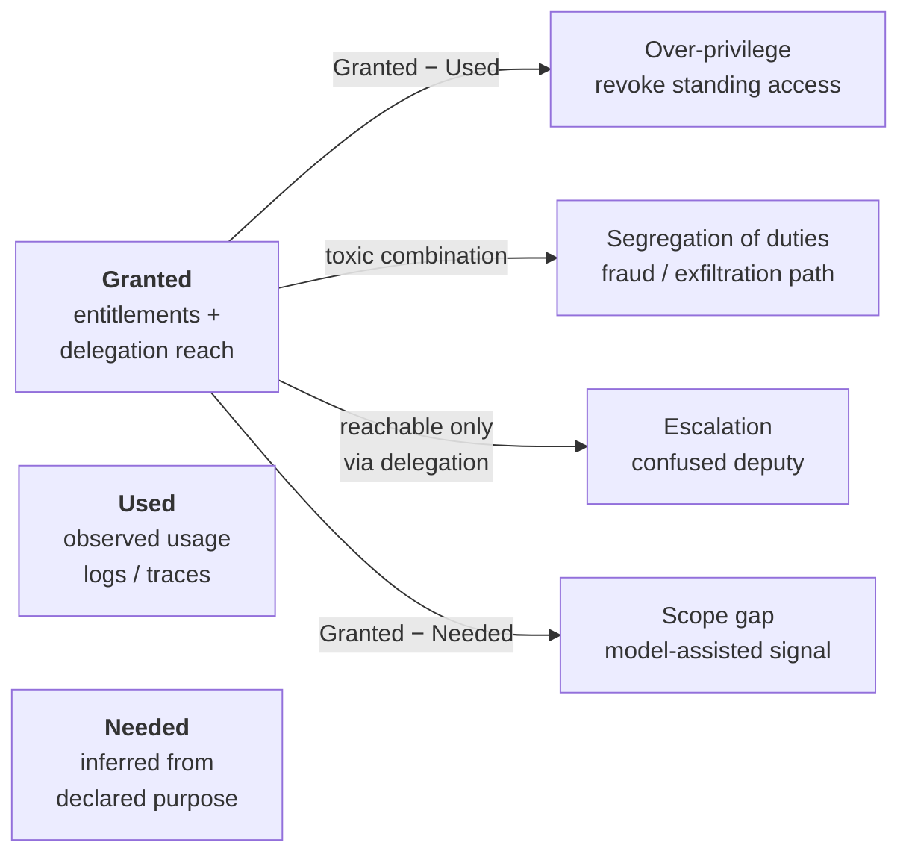
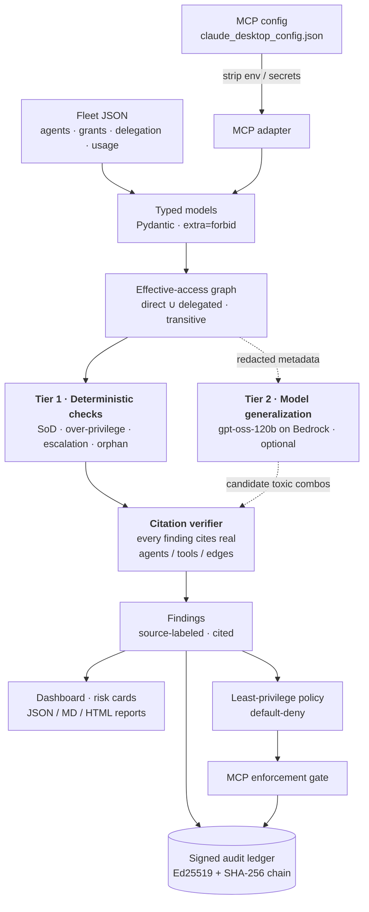
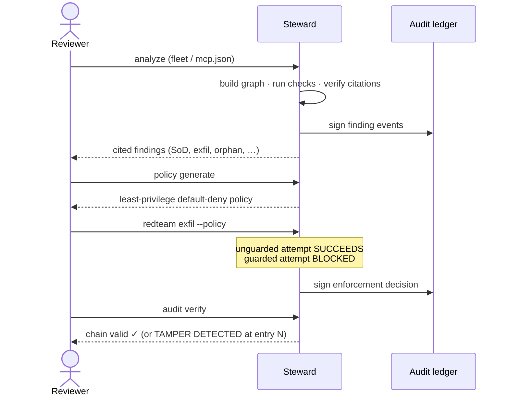
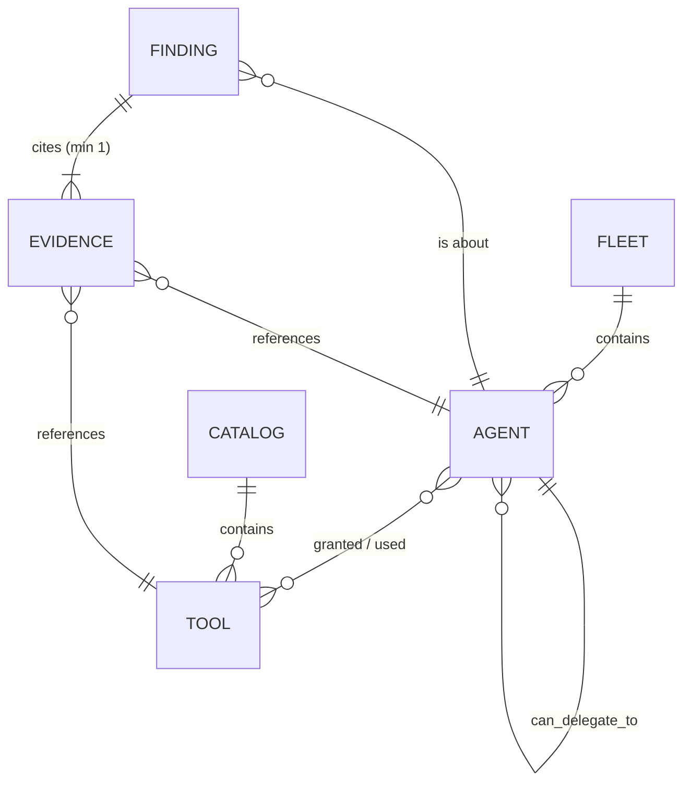

# Steward — Architecture

This document explains *how Steward is built and why*. For install and usage,
see the [README](../README.md).

- [1. The problem](#1-the-problem)
- [2. Core model: Granted vs. Used vs. Needed](#2-core-model-granted-vs-used-vs-needed)
- [3. System architecture](#3-system-architecture)
- [4. The two-tier trust model](#4-the-two-tier-trust-model)
- [5. The four checks](#5-the-four-checks)
- [6. Citation verification — why no finding is ever hallucinated](#6-citation-verification--why-no-finding-is-ever-hallucinated)
- [7. Detect → close → prove](#7-detect--close--prove)
- [8. Domain model](#8-domain-model)
- [9. The signed audit ledger](#9-the-signed-audit-ledger)
- [10. Security posture](#10-security-posture)
- [11. Key design decisions & tradeoffs](#11-key-design-decisions--tradeoffs)
- [12. Boundaries & roadmap](#12-boundaries--roadmap)

---

> Positioning in one line: Steward is **non-human identity (NHI) governance
> for AI agents** — configuration-time, read-only, self-hosted, and
> evidence-first, so adopting it carries no production risk and its output is
> usable as audit evidence.

## 1. The problem

Enterprises are deploying fleets of AI agents that hold real entitlements —
tools, API scopes, database access — and that can **delegate to one another**.
Traditional Identity Governance & Administration (IGA) answers "who can do what"
for humans. Nobody has a good answer for agents, and agents make the classic
problems worse:

- **Segregation of Duties (SoD).** An agent that can both *create a vendor* and
  *approve its payment* is a one-identity fraud path — the same toxic
  combination auditors have policed in ERP systems for decades, now assembled at
  runtime by agents that invent their own workflows.
- **Over-privilege.** Agents accumulate standing grants they never use, widening
  the blast radius of a prompt injection or a compromised key.
- **Escalation via delegation.** A "harmless" read-only agent that can delegate
  to a privileged one *effectively* holds the privileged capability — the
  confused-deputy problem.
- **Orphaned identities.** Agents with no accountable human owner drift out of
  any review cycle.

Incumbent IGA platforms (SailPoint, Saviynt) encode SoD as **hand-written
rulesets per application**. That does not scale to agents whose tool sets are
open-ended. Steward's thesis: keep a deterministic floor for the known
crown-jewel risks, and use a language model to *generalize* toxic-combination
reasoning to tools nobody pre-registered — but never let the model's word alone
become a finding.

## 2. Core model: Granted vs. Used vs. Needed

Every check in Steward is a comparison between three views of an agent's
authority:

- **Granted** is computed deterministically from the inventory (direct grants ∪
  everything reachable through delegation).
- **Used** comes from the agent's usage log — or, at runtime scale, from an
  ingested execution trace; when a source (e.g. an MCP config) has no
  telemetry, "Used" is marked *unavailable* and over-privilege is not claimed.
- **Needed** is *inferred* by the model from the agent's declared purpose. It is
  the one signal that is model-assisted rather than graph-derived, so it is
  labelled separately and never gated as ground truth.

### Runtime traces (`steward analyze --traces`)

`steward/traces.py` ingests a minimal JSONL trace — one event per line with
`timestamp`, `agent_id`, `tool_id`, and optional `status`, a shape that maps
directly from OpenTelemetry GenAI spans (`gen_ai.agent.id`, `gen_ai.tool.name`)
or any framework's invocation log. Payload-bearing fields (arguments, results,
prompts) are dropped at parse time, never retained. Observed usage replaces the
inventory's usage log for observed agents only — an agent absent from the trace
window keeps *unavailable* rather than being misread as unused — and
reconciliation then reports three runtime signals:

| Signal | Derivation | Trust level |
|---|---|---|
| **Granted but never used** | direct grants − observed use, per observed agent | deterministic; feeds the over-privilege check |
| **Used but not granted** | observed use − *effective* access | deterministic drift: a stale inventory or an unenforced one. Deliberately **not** a `Finding` — the citation verifier rejects evidence outside effective access by design, so this surfaces as a reconciliation drift line instead |
| **Used but not needed** | observed use ∩ (effective − model-inferred Needed) | model-assisted review context, labelled as such |

Events naming an agent or tool the inventory has never heard of stay visible as
unrecognized entries (a retired identity still running is itself a governance
signal) rather than being silently dropped.

## 3. System architecture

The critical property of this diagram: **the model (Tier 2) feeds the citation
verifier, not the output.** Nothing the model proposes reaches a report, the
dashboard, or the ledger until Steward has re-derived and checked its evidence
against the loaded graph.

Module map:

| Concern | Module |
|---|---|
| Typed inventory & schemas | `steward/models.py`, `steward/loaders.py` |
| Effective-access graph | `steward/graph.py` |
| Deterministic checks + citation verifier | `steward/findings.py` |
| Model enrichment (Bedrock Converse) | `steward/llm.py`, `steward/pipeline.py` |
| Redaction boundary | `steward/redaction.py` |
| MCP config ingestion | `steward/adapters.py` |
| Least-privilege policy | `steward/policy_gen.py` |
| Enforcement gate | `steward/enforce.py` |
| Red-team scenario | `steward/redteam.py` |
| Signed audit ledger | `steward/ledger.py` |
| Incident/OWASP context | `steward/incident_grounding.py` |
| Reports, API, dashboard, CLI | `steward/reporting.py`, `steward/web_service.py`, `steward/app.py`, `steward/cli.py` |

## 4. The two-tier trust model

Steward deliberately separates two kinds of signal so a reviewer always knows
what they are trusting.

**Tier 1 — deterministic floor.** Works with zero model access. Builds a
NetworkX graph, computes effective access, hard-asserts the crown-jewel toxic
pairs, finds unused grants / delegated blast radius / orphans, and verifies
every citation. This tier is the CI gate: it must hold **precision = recall =
1.000** on the labeled synthetic fleet, with zero false positives on the 20
clean control agents. A regression, an invalid citation, or a false positive
fails the build.

**Tier 2 — model generalization.** Optional. `gpt-oss-120b` on Amazon Bedrock
(any Converse-capable model drops in via `MODEL_*` env vars — GPT-5.6 Sol/Terra/
Luna on accounts that have them). It (a) classifies unfamiliar tools into
business capabilities, (b) infers each agent's *Needed* capabilities, and (c)
proposes *additional* toxic combinations beyond the hardcoded set. Its output is
**measured separately and is not required-perfect** — it is a recall aid on top
of a trustworthy floor, not a replacement for it.

> The moat is the code around the model, not the prompt inside it. *A skill is
> advice; Steward is evidence.*

### How accurate is Tier 2, actually?

Two separate measurements, neither of which gates CI:

- The **offline integration fixture** in `make eval` proves the pipeline wiring
  can carry a model proposal through the citation gate with no AWS account. It
  measures integration, not model accuracy.
- A **labeled 20-scenario accuracy benchmark** (`evals/benchmark/`, live run via
  `make llm-benchmark-live`) measures the model tier itself. Every scenario
  agent holds exactly one two-tool combination with a ground-truth label:
  **8 in-scope toxic pairs** (sensitive-read + external-egress across support,
  HR, finance, health-claims, source-code, CRM, legal, and compensation data),
  **8 benign near-misses** (internal-only delivery, draft-only senders, ticket
  creation, summarization, public sources), and **4 genuinely toxic pairs that
  are deliberately outside the v0.1 egress-only prompt** (novel
  initiate-vs-approve, hire-vs-pay, and request-vs-grant variants plus a
  destructive purge pair). The benchmark fleet is deterministically silent, so
  every flag is model-tier output.

Cached live `gpt-oss-120b` result (committed in `evals/benchmark/results.json`;
CI re-verifies its internal consistency and citation validity without a model
call):

| Measurement | Result |
|---|---|
| In-scope toxic pairs flagged (recall) | **8/8 (1.000)** |
| False positives on benign near-misses | **0/8 (precision 1.000)** |
| Hallucinated citations in surfaced findings | **0 (required 0)** |
| Out-of-scope toxic pairs flagged | 0/4 — the prompt's documented scope boundary held |
| Raw proposals citing unknown/non-effective entities | 0 of 8 (the citation gate had nothing to block in this run) |

Honest limits: this is 20 synthetic scenarios and a single temperature-0 run,
and each scenario agent holds only its labeled pair. It demonstrates the v0.1
egress lens separates toxic pairs from engineered near-misses with zero
fabricated evidence — it is not a real-world accuracy claim at fleet scale.
The four out-of-scope families are the deterministic floor's territory today
and the model tier's roadmap; a reviewer should read `0/4` as scope discipline,
not as detection.

## 5. The four checks

| Check | `check_type` | What it compares | Deterministic rule |
|---|---|---|---|
| **Segregation of duties** | `sod` | A single agent holds (directly or transitively) a toxic capability combination | vendor-create + payment-approve · employee-add + payroll-run · access-request + access-grant · sensitive-read + external-egress |
| **Over-privilege** | `over_privilege` | `Granted − Used` on direct grants | any high-risk grant absent from the usage log |
| **Escalation** | `escalation` | High-risk capability reachable **only** through delegation | delegated payment-approval, payroll, access-grant, external egress, data export, record deletion |
| **Orphan** | `orphan` | Ownership | `owner is None` |

The model's Tier-2 job is to widen the *first* row — spotting toxic combinations
(e.g. `read_crm` + `send_external_email`) that no hardcoded rule anticipated —
while the deterministic pairs guarantee the crown-jewel findings never depend on
model variance.

### The lethal trifecta (named pattern check)

One deterministic rule deserves its name: an agent whose **effective** access
spans (1) private-data reads, (2) exposure to untrusted content, and (3) an
exfiltration channel is one prompt injection away from data theft — [Simon
Willison's "lethal trifecta"](https://simonwillison.net/2025/Jun/16/the-lethal-trifecta/).
Steward flags the pattern as a critical, citation-verified `sod` finding
(`rule_id: lethal_trifecta`); a leg reached only through delegation still
completes it. The shipped synthetic fleet deliberately contains no trifecta
agent, so the check is **zero-noise today** — the test suite proves both that
silence and the detection itself with crafted fixtures, including a trifecta
completed through a delegation edge. The three capability-class sets live in
`steward/capability_classes.py`, shared with the risk score below so the two
features cannot drift apart.

## 5b. Risk prioritization and control-framework context

Two deterministic layers turn verified findings into a CISO-ready queue:

**Composite risk score (`steward/scoring.py`).** Every finding gets a 0–100
score an auditor can recompute by hand: base severity (critical 40 / high 30 /
medium 20 / low 10) + blast radius (+4 per high-impact capability in effective
access, capped +20) + data sensitivity (+10 for sensitive-read reach) +
exploitability (+10 direct grant, +5 delegated-only, +10 more when the agent is
exposed to untrusted content). The factor breakdown ships with the score, and
findings, reports, and the certification queue all rank by it. No model call is
involved: the same fleet produces the same ranking every run.

**Control-framework mapping (`steward/control_mapping.py`).** Each finding
carries structured references into NIST SP 800-53 Rev. 5, SOC 2 TSC (2017),
ISO/IEC 27001:2022, SOX ITGC, and the EU AI Act (Art. 14 human oversight for
SoD; Art. 12 record-keeping for the ledger), with framework versions cited in
the data. The audit report aggregates them into a coverage matrix, and the
signed ledger + certification queue map separately as *process* controls
(AU-2/AU-6, AC-2 review, A.8.15). Everywhere it appears, the mapping is framed
as speaking the auditor's language — never as a compliance certification.

The report's executive summary composes both: fleet scope, top risks by
composite score, framework coverage counts, and certification review status —
the one-page rollup a CISO hands upward, derived entirely from reproducible
data.

### Mapping to OWASP LLM Top 10 (2025)

Steward's checks are not arbitrary — they are the identity-governance view of the
industry's agent-security taxonomy. **OWASP LLM06: Excessive Agency** is defined
as excessive *permissions*, excessive *functionality*, and excessive *autonomy* —
a near-exact description of Steward's three access checks.

| Steward check | OWASP LLM Top 10 (2025) | OWASP MCP Top 10 |
|---|---|---|
| Over-privilege (`Granted − Used`) | **LLM06 Excessive Agency** — excessive permissions | — |
| SoD toxic combination | **LLM06 Excessive Agency** — excessive functionality | — |
| Escalation via delegation | **LLM06 Excessive Agency** — excessive autonomy (confused deputy) | **MCP02** Privilege Escalation via Scope Creep |
| Sensitive-data + external-egress (SupportBot / SalesBot) | **LLM02 Sensitive Information Disclosure** | **MCP03** Tool Poisoning · **MCP04** Supply-Chain |
| Orphaned agent | Insecure design / accountability gap | **MCP01** Token & Secret Exposure (adjacent) |

Steward is a *preventive* control for Excessive Agency: it finds the excess in an
agent's granted authority before an attacker (via prompt injection, LLM01) can
weaponize it. The findings already carry structured OWASP **MCP** references in
their `owasp_mcp` field; the LLM Top 10 mapping above is the complementary lens
for AI-security reviewers.

## 6. Citation verification — why no finding is ever hallucinated

Every `Finding` must carry `evidence: list[Evidence]` with **at least one**
item, and each `Evidence` points at a real graph entity (`agent`, `tool`, or
`delegation_edge`). Before any finding reaches the API, report, UI, or ledger,
`verify_finding_evidence` (in `steward/findings.py`) checks that:

1. the finding's subject agent exists in the loaded fleet;
2. every cited tool is genuinely *effective access* for that subject (not merely
   a real tool somewhere else in the graph);
3. every cited delegation edge exists **and lies on a path** from the subject;
4. for `over_privilege`, the cited tool is a *direct* grant (not an inherited
   one);
5. the finding cites its own subject agent.

Any finding that fails is **dropped**, regardless of source. This is what lets
Tier 2 be useful without being dangerous: the model can propose a pair, but
Steward builds the evidence itself and re-runs this gate. A model that
hallucinates an entity simply produces a finding that fails verification and
never surfaces.

## 7. Detect → close → prove

Steward doesn't stop at detection. The same engine closes the route and proves
it — entirely offline, no key required.

- **Detect** — cited findings, each signed into the ledger.
- **Close** — a deterministic, default-deny least-privilege policy derived from
  the cited findings (`steward/policy_gen.py`).
- **Prove** — a harmless bundled red-team scenario shows the PII-to-external
  exfiltration succeeding *unguarded* and blocked *through the policy gate*, with
  the decision signed into the ledger; `audit verify` then re-checks the whole
  chain offline.

## 8. Domain model

All models are Pydantic with `extra="forbid"` — an unexpected field in an
inventory is a load error, not silently ignored. `Tool` deliberately has **no**
`business_capability` field: capability is inferred by the model layer, never
hand-labelled in the catalog, so the catalog stays a pure statement of *what
exists*. See `steward/models.py`.

## 9. The signed audit ledger

`steward/ledger.py` implements a small, file-backed, tamper-evident log
(`.steward/audit.jsonl`). It is **not** a distributed transparency log; it is a
local proof that a decision occurred.

- Each entry is a canonical JSON document **chained** to the SHA-256 of the
  prior entry's body and **signed** with an **Ed25519** key.
- Event types: `finding`, `certification`, `enforcement`.
- The **private key** (`ledger_ed25519.pem`) stays local and is gitignored; the
  **public key** (`ledger_ed25519.pub`) may be published so an independent
  reviewer can verify signatures offline.
- `audit verify` recomputes every hash link and signature; any single-byte
  mutation is reported as `TAMPER DETECTED at entry N`, and the ledger refuses to
  append to a damaged chain. A Hypothesis property test asserts both directions:
  any legal sequence verifies, every mutation is caught.

Crucially, the ledger inherits the same redaction boundary as the model layer
(next section): tool-call arguments, recipient fields, and PII-bearing fields
are stored as **SHA-256 commitments**, never raw values.

## 10. Security posture

Steward is a security tool, so it holds itself to the standard it audits.

- **It never sends payloads to a model.** Only *configuration metadata* (tool
  names/descriptions, agent purpose, grants, delegation edges) is analyzed.
- **Secrets are scrubbed before any egress.** MCP configs routinely embed API
  keys in `env`. Before any model call — or any cache/log/ledger write —
  `steward/redaction.py` removes `env` values and masks secret-shaped strings
  (`sk-…`, `AKIA…`, `Bearer …`, tokens, passwords, high-entropy values).
  `tests/test_llm_redaction.py` plants a fake secret and proves it is absent from
  the outbound Converse payload and the cost/latency log.
- **Logs are metadata-only** — operation, model ID, timing, status, and
  character counts; never prompts or config values.
- **Credentials use the standard AWS chain**; no key or model ID is hardcoded or
  committed. `.env` is gitignored.

## 11. Key design decisions & tradeoffs

| Decision | Chose | Over | Why |
|---|---|---|---|
| Toxic-combo detection | Deterministic floor **+** model generalization | Pure rulesets (SailPoint-style) or pure LLM | Rules can't scale to open-ended agent tools; a bare LLM can't be trusted for audit. The hybrid keeps crown jewels reliable and still generalizes. |
| Model output | Feeds the **citation verifier**, not the report | Trusting model findings directly | Guarantees no hallucinated finding ever surfaces — the core credibility property. |
| Effective access | **Transitive graph** (NetworkX) | Flat per-agent grant list | Escalation / blast-radius requires reachability, which LLMs do unreliably. |
| Accuracy claim | Regression + precision **gate** on a labeled fixture | "It's accurate" | Honest: proves the floor is stable and false-positive-free on the fixture; explicitly *not* a real-world accuracy benchmark. |
| Data | Authored **synthetic fleet + answer key** | Real entitlement data | No privacy exposure; doubles as the zero-key demo and the eval ground truth. |
| Audit trail | Local **Ed25519 + SHA-256** ledger with PII commitments | A plaintext log, or nothing | Provable and tamper-evident without becoming a second store of sensitive data. |
| Runtime model | **Configurable** via `MODEL_*` (gpt-oss-120b default) | Hardcoding one provider | Swap the model without touching the engine; the trust properties are model-independent. |
| Agent shape | Single analysis pipeline | Multi-agent framework | Unearned complexity for a batch analyzer. |

## 12. Boundaries & roadmap

**What v0.1 is not.** Configuration-time analysis, not an authentication system
or a compliance certification. The enforcement demo is a deliberately narrow
policy-evaluating pass-through — no OAuth/OIDC, no multi-upstream federation, no
runtime payload inspection. An MCP config declares *servers*, not their
runtime-discovered functions: recognized packages import at documented-capability
granularity, everything else at the server-bundle level; the richest analysis
uses the native fleet export. Trace ingestion is batch-file reconciliation of an
observed window, not continuous monitoring.

**Where it goes next.**

- **Used pillar continuously** — stream execution traces instead of batch files,
  with windowed drift alerts on used-but-not-granted events.
- **Live connectors** — pull inventories from agent registries, MCP gateways, and
  cloud IAM (AWS IAM, Entra Agent ID, Okta, SailPoint) instead of file exports.
- **Continuous certification** — recurring access-review campaigns and
  remediation workflows (revoke / ticket).
- **Behavioral assurance** — reuse the eval engine to check that agents *behave*
  safely (grounding, refusal, no-leak), turning Steward into identity governance
  **and** behavioral assurance for enterprise AI agents.
